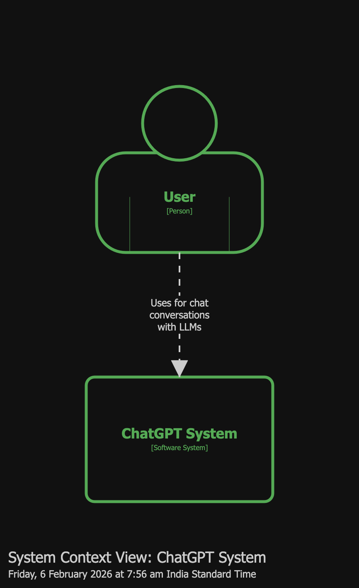
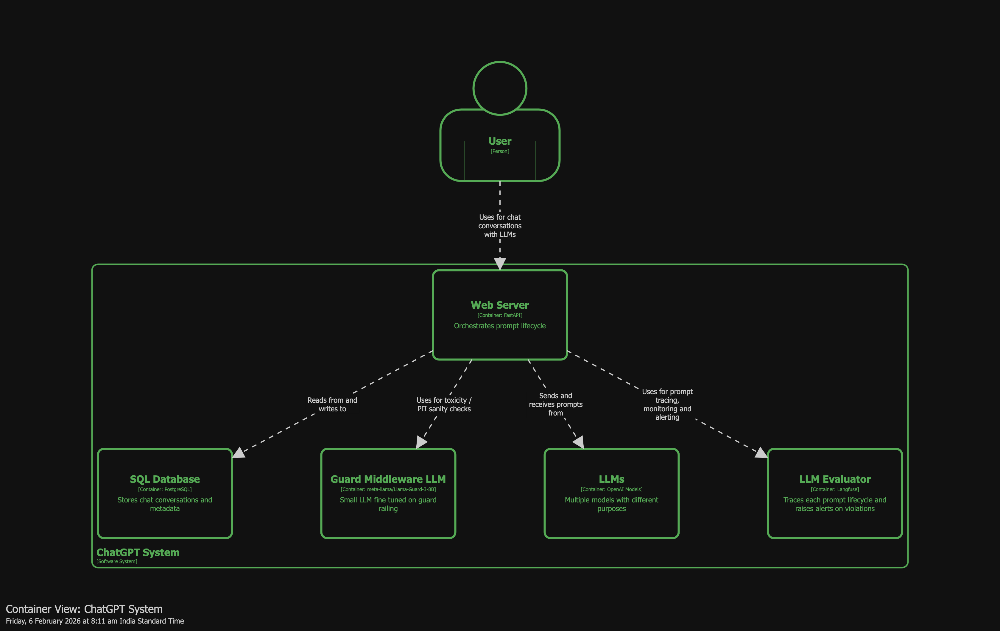

# System Design of ChatGPT

This is a design document of a ChatGPT system - a chatbot service that interacts with a large language model (LLM) to provide answers to user's prompts.

# Functional Requirements

## In Scope

- provide a user interface for the user to enter prompts
- user should be able to switch between supported LLMs
- LLM should respond to user's prompt
- LLM should maintain context of the conversation
- user should be able to switch between conversations

## Out of Scope

- registration and authentication
- file attachments
- subscriptions
- archiving
- agents

# Non Functional Requirements

- latency - low for the interface, variable for prompt response
- scale
  - DAU - 100 million users
  - QPS - 10 million
- availability - 99.9%
- durability - conversations should not be lost
- consistency - eventual
- extensibility - system should be able to support newer models
- observability - system should guard users from malicious, inappropriate responses from the LLMs

# Actors Actions

# Workflow

# Observability Workflow

# Components

# Characteristics

# Quanta

# Architecture Styles

# C1

# C2

# Scaling

- webserver
  Use multiple pods with a load balancer as they are stateless.
  Add redis for session management.

- data store
  Use one or two writer databases with mutiple reader databases. Solves for eventual consistency and latency. Position read databases across the globe - users can query from nearest database. Can apply sharding techniques by user location later on.

- guard middleware
  Use edge deployment such as lambda functions that can serve users based on location.
  Apply semantic caching to reduce latency and number of pods needed to serve the scale.

- llms
  Apply rate limiting across models. Implement router in webserver to switch between models.
  Add a load balancer for each model in multiple pods.

- llm observability
  Use TTL to remove traces after 30 or 60 days.
  Always apply tracing asynchronously in the background without disturbing prompt lifecycle.
