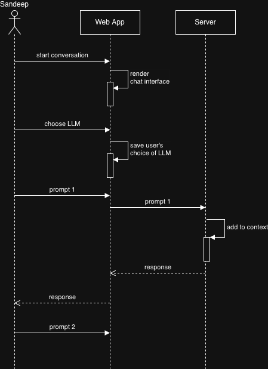
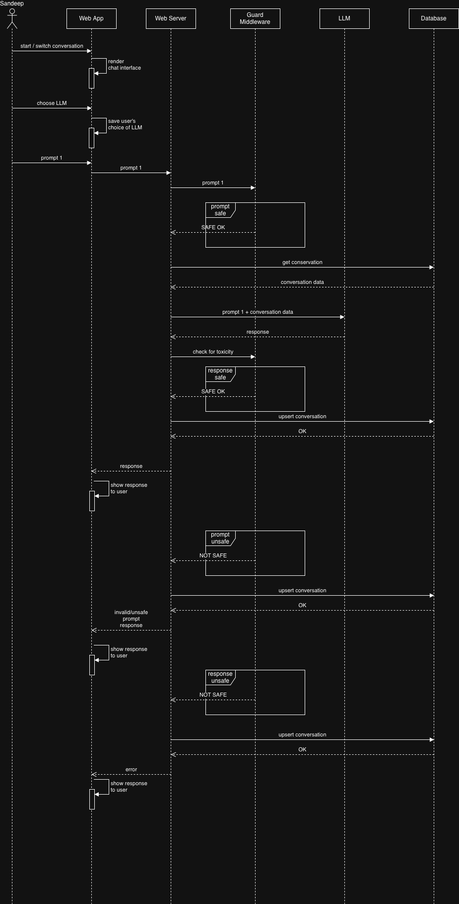
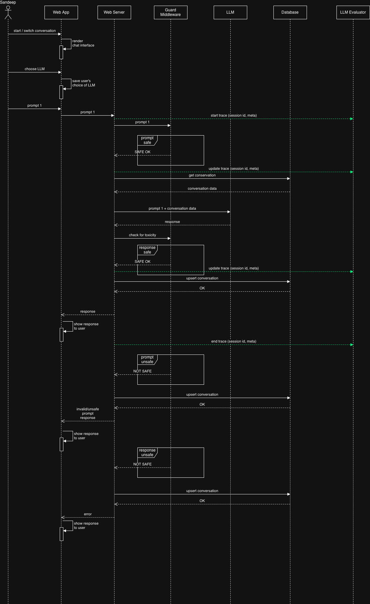
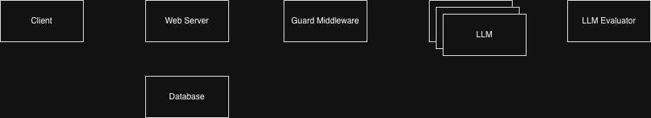
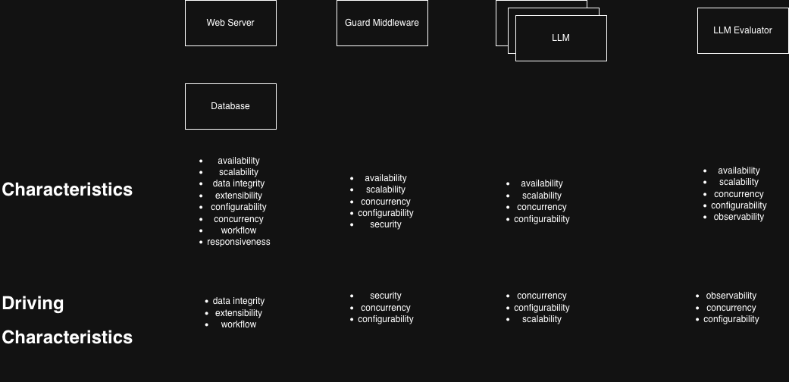
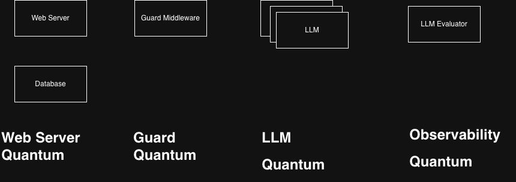
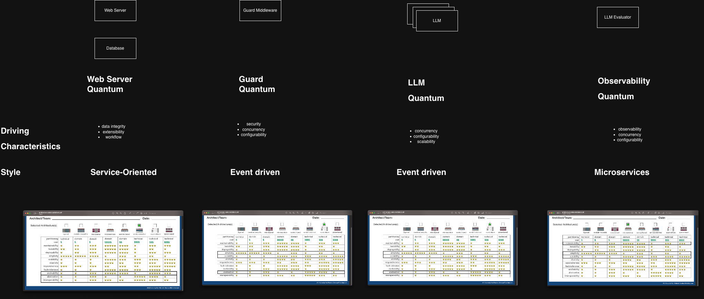

# System Design of ChatGPT

This is a design document of a ChatGPT system - a chatbot service that interacts with a large language model (LLM) to provide answers to user's prompts.

# Functional Requirements

## In Scope

- provide a user interface for the user to enter prompts
- user should be able to switch between supported LLMs
- LLM should respond to user's prompt
- LLM should maintain context of the conversation
- user should be able to switch between conversations

## Out of Scope

- registration and authentication
- file attachments
- subscriptions
- archiving
- agents

# Non Functional Requirements

- latency - low for the interface, variable for prompt response
- scale
  - DAU - 10 million users
  - QPS - 1 million
- availability - 99.9%
- durability - high - conversations should not be lost
- consistency - eventual
- extensibility - system should be able to support newer models
- observability - system should guard users from malicious, inappropriate responses from the LLMs

# Actors Actions

# Workflow

# Observability Workflow

# Components

# Characteristics

# Quanta

# Architecture Styles

