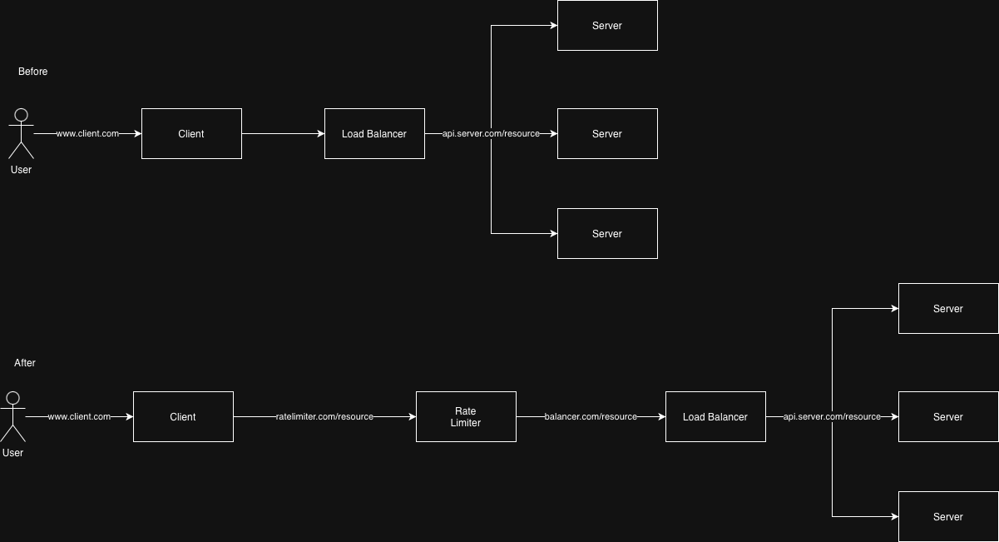
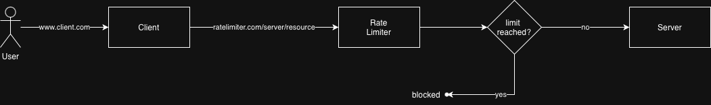
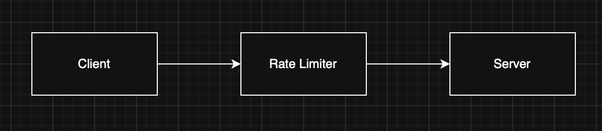

# System Design for a 'Rate Limiter System'

This document provides a detailed overview of the system design for a rate limiter system.
A rate limiter system sets a limit on the number of http requests this system can pass through over a certain interval of time before blocking them.

Examples:

- maximum 5 login attempts per minute
- maximum 3 tweets per second
- maximum 4 bookings from same IP address in a week

## Why

- prevents DoS attacks
- saves API costs
- reduces server load

# Functional Requirements

- system should allow configuration of rate limits and rules
- system should allow configuration of the storage server
- system should accept connections within the set rate limit
- system should reject connections outside the set rate limit
- system should reset limit when the set interval is passed
- system should support rate across multiple servers in a distributed environment

# Non Functional Requirements

### Deployment

- system should be independently deployable

### Scale

- system should support large number of requests

### Performance

- system should not slow down current http response time
- system should have low storage / memory footprint

### Availability

- system should not break when something goes wrong with rate limiter

# Actors and Actions

Without a rate limiter system, a user's request is routed through a client interface (browser/app) directly to a server to request a backend resource.

With a rate limiter, the request is now routed through the rate limiter system where checks can be made on the limits.

As shown, the rate limiter is positioned before the load balancer. Refer to [ADR01](./ADRs/ADR01%20-%20where%20to%20position%20the%20rate%20limiter.md) to understand this decision.

# Event Storming

# High Level Design

