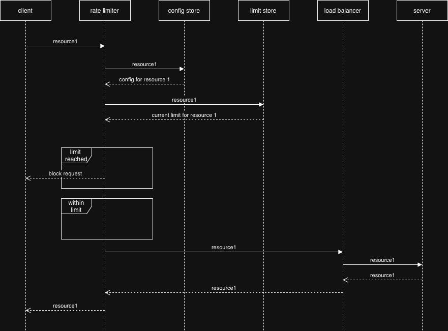
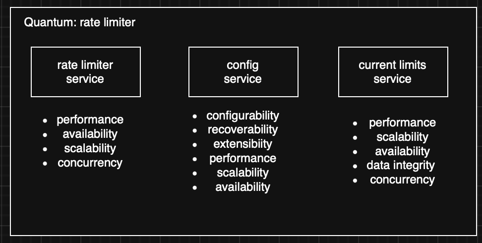
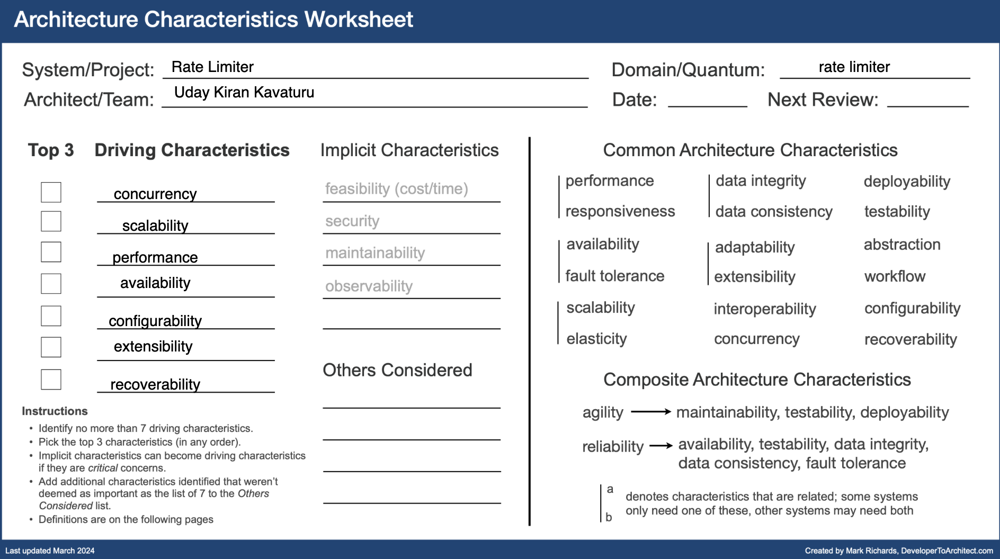
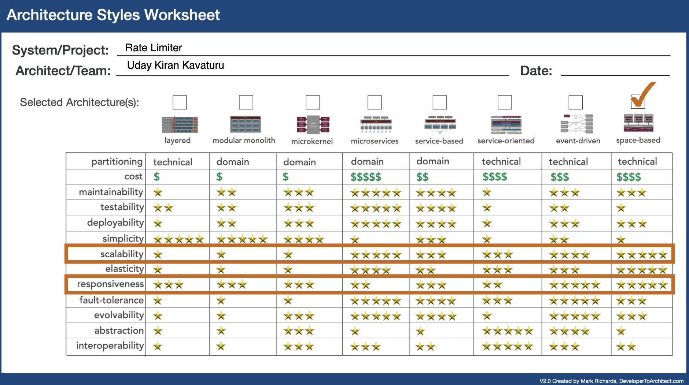
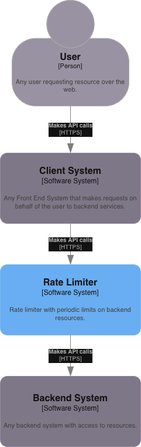
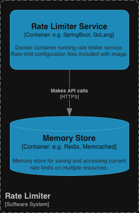
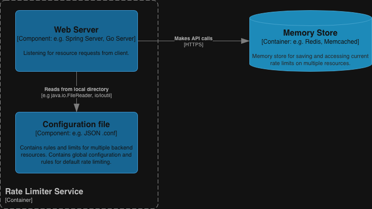
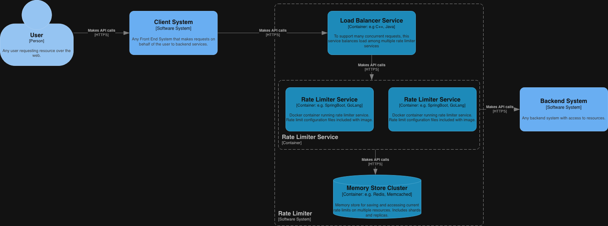

# System Design for a 'Rate Limiter System'

This document provides a detailed overview of the system design for a rate limiter system.
A rate limiter system sets a limit on the number of http requests this system can pass through over a certain interval of time before blocking them.

Examples:

- maximum 5 login attempts per minute
- maximum 3 tweets per second
- maximum 4 bookings from same IP address in a week

## Why

- prevents DoS attacks
- saves API costs
- reduces server load

# Functional Requirements

- system should allow configuration of rate limits and rules
- system should allow configuration of the storage server
- system should accept connections within the set rate limit
- system should reject connections outside the set rate limit
- system should reset limit when the set interval is passed
- system should support rate limiting across multiple servers in a distributed environment

# Non Functional Requirements

### Deployment

- system should be independently deployable

### Scale

- system should support large number of requests
  - 100 million daily active users (DAU)
    - 10 million requests per second (rps)

### Performance

- system should not slow down current http response time
  - <10ms rate limit check time
- system should have low storage / memory footprint

### Availability

- system should not break when something goes wrong with rate limiter

# Actors and Actions

Without a rate limiter system, a user's request is routed through a client interface (browser/app) directly to a server to request a backend resource.

With a rate limiter, the request is now routed through the rate limiter system where checks can be made on the limits.

As shown, the rate limiter is positioned before the load balancer. Refer to [ADR01-Positioning the Rate Limiter](./Architecture%20Decision%20Records/ADR01%20-%20where%20to%20position%20the%20rate%20limiter.md) to understand this decision.

# Event Storming

Two events are possible for any request. Limit is either reached or limit is not reached.

# Workflow

# Components Identified

- rate limiter server
- storage for current limits
- storage for configuration of limits

# Quanta Identified

## Rate Limiter Quantum

Considering the overlapping architectural charateristics for the identified components, only one quantum is identified for building the rate limiter system.

### Architectural Style Identified

# C1 Diagram

# C2 Diagram

# C3 Diagram

# Risk Assessment

| Risk                     | Likelihood | Impact | Mitigation                                                                            |
| ------------------------ | ---------- | ------ | ------------------------------------------------------------------------------------- |
| Single point of failure  | Medium     | High   | Use a load balancer with failover. Implement a fail-open mechanism at client level.   |
| Performance bottleneck   | Medium     | High   | Use a high-performance memory store like Redis. Optimize the rate limiting algorithm. |
| Incorrect configuration  | High       | Medium | Use CI CD and version control for configuration.                                      |
| Data storage failure     | Medium     | High   | Use a clustered data store with replication.                                          |
| Inaccurate rate limiting | Medium     | Medium | Use an accurate algorithm.                                                            |

# Deployment Diagram

# Rate Limiting Algorithm Identified

Refer to [ADR02-Choosing the Rate Limiting Algorithm](./Architecture%20Decision%20Records//ADR02%20-%20choosing%20the%20rate%20limiting%20algorithm.md)

# Memory Store Identified

Refer to [ADR03-Choosing the Memory Store](./Architecture%20Decision%20Records/ADR03%20-%20choosing%20the%20memory%20store.md)

# Sharding

Refer to [ADR04-Sharding](./Architecture%20Decision%20Records/ADR04%20-%20choosing%20a%20sharding%20strategy.md)

# Cleanup

Use TTL for keys with configured interval + buffer.

# Failover

When redis or rate limiter service fails, stop everything. Handle gracefully.
