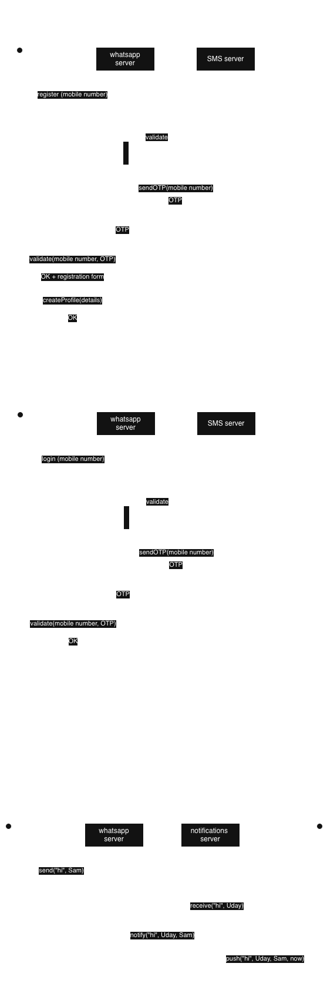
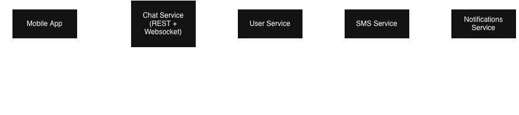
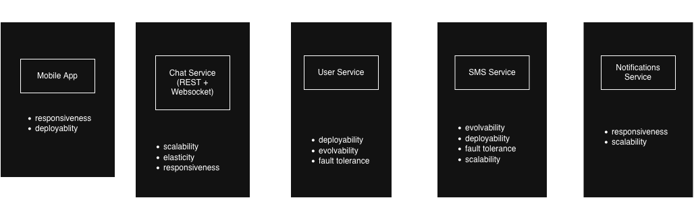
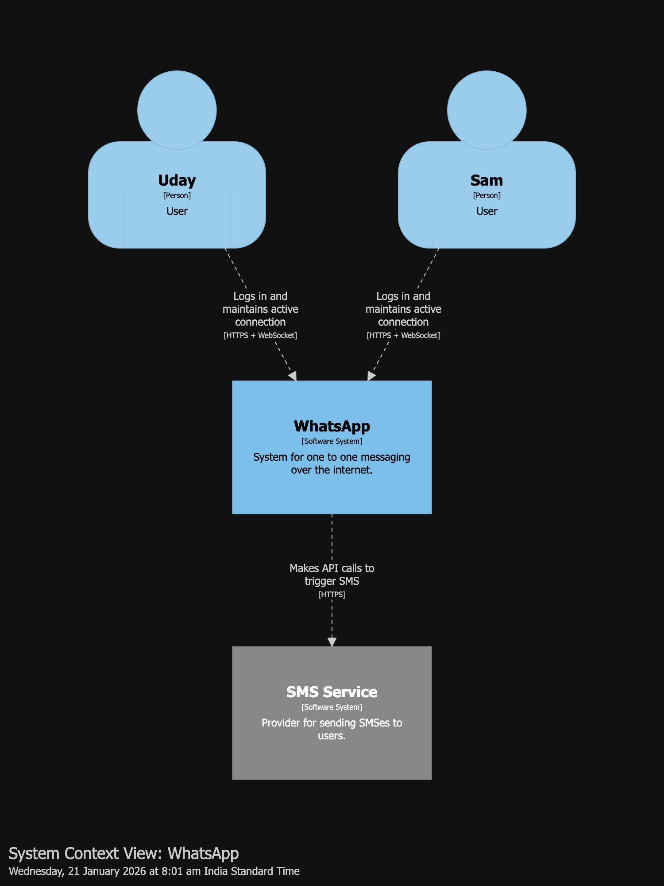
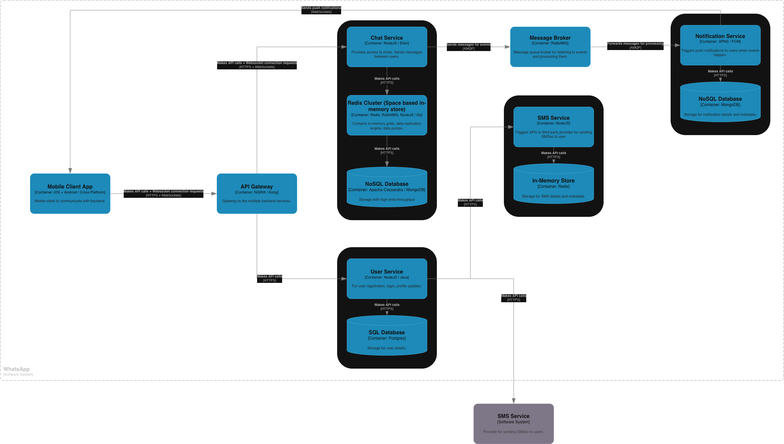
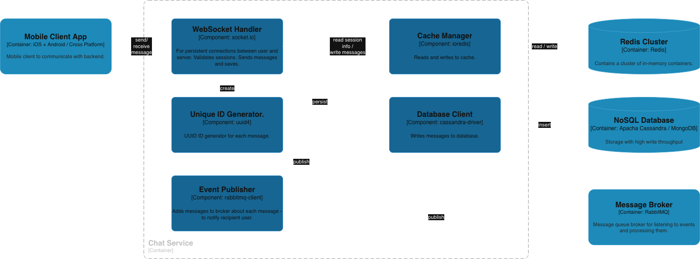

# System design for 'whatsapp'

whatsapp is a communicator app - it includes 1:1 messaging, group chats, 1:1 calling, group calls, sharing files, backups, payment and more.

# Restricting scope for system design

## In scope

- registration and authentication (high level)
- focus on 1:1 messaging
- notifications (high level)

## Out of scope

- everything else

# Functional requirements

- system should allow registration of new users
- system should allow authentication of existing users
- user should be able to send text message via internet to other users on the platform
- user should be able to receive text message from other users
- user should be notified when a new message arrives in near real time

# Non functional requirements

- scalability
  - daily active users (DAU) - 1 billion
  - queries per second (QPS) - 1 million
  - peak qps - 100 million
  - storage @ 1kb per message - retention of 7 days
    - ~2.1 PB (see [storage calcuation](./assets/storage%20calculation.png))
- performance
  - <500 ms
- availability
  - 99.99% for chat, 99.9% for notifications
- durability
  - messages are never lost
- consistency
  - messages are delivered in sequence

# Actors Actions

# Event Storming

# Workflow

# Components

# Characteristics

# Quanta

# Architecture Styles

# C1

# C2

# C3

# Capacity Planning | Back of the Envelope Estimation

| Component          | Constraint               | Scaling Metric             | Est. Count      |
| :----------------- | :----------------------- | :------------------------- | :-------------- |
| **Chat Service**   | Concurrent Connections   | 100M Users / 20k per pod   | **~5,000 Pods** |
| **User Service**   | CPU / Throughput         | 1M QPS / 1k per pod        | **~1,000 Pods** |
| **Notif. Service** | I/O Wait (3rd Party API) | 200k Push/s / 2k per pod   | **~100 Pods**   |
| **Cassandra**      | Write Speed (I/O)        | 1M Write/s / 10k per node  | **~100 Nodes**  |
| **Redis**          | RAM (Memory)             | 100GB Data / 16GB per node | **~12 Nodes**   |
