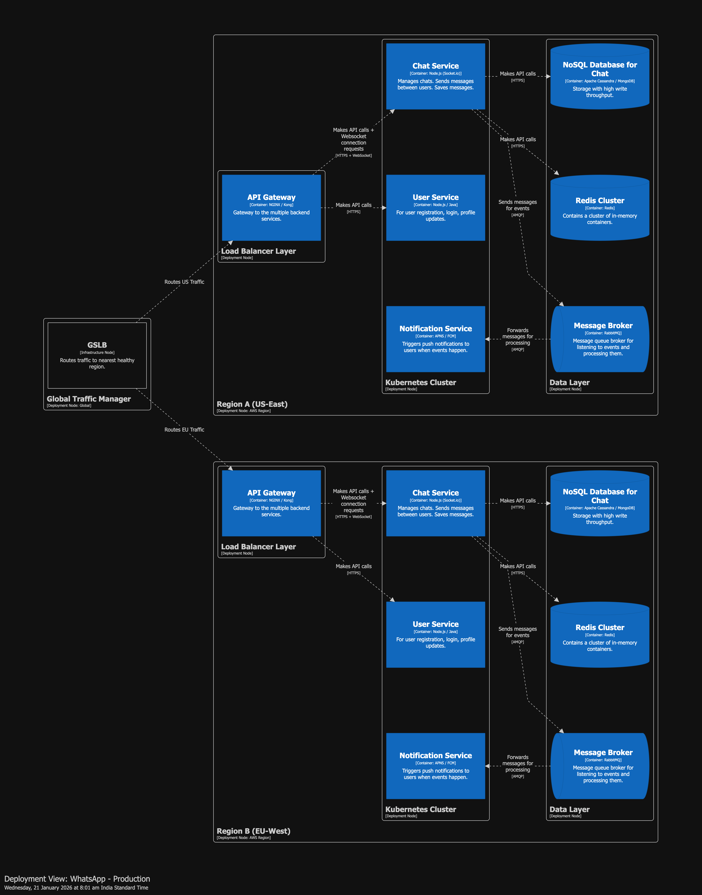

# System design for 'whatsapp'

whatsapp is a communicator app - it includes 1:1 messaging, group chats, 1:1 calling, group calls, sharing files, backups, payments and more.

# Restricting scope for system design

## In scope

- registration and authentication (high level)
- focus on 1:1 messaging
- notifications (high level)

## Out of scope

- everything else

# Functional requirements

- system should allow registration of new users
- system should allow authentication of existing users
- user should be able to send text message via internet to other users on the platform
- user should be able to receive text message from other users
- user should be notified when a new message arrives in near real time

# Non functional requirements

- scalability
  - daily active users (DAU) - 1 billion
  - queries per second (QPS) - 1 million
  - peak qps - 100 million
  - storage @ 1kb per message - retention of 7 days
    - ~2.1 PB (see [storage calcuation](./assets/storage%20calculation.png))
- performance
  - <500 ms
- availability
  - 99.99% for chat, 99.9% for notifications
- durability
  - messages are never lost
- consistency
  - messages are delivered in sequence

# Actors Actions

# Event Storming

# Workflow

# Components

# Characteristics

# Quanta

# Architecture Styles

# C1

# C2

# Deployment

# Workflow

# To show user online/offline status

- use websocket ping pong

# When receiver is offline

- disconnection session after threshold timeout
- hold undelivered messages in database, trigger delivery on new connection

# When phone crashes

- connection to websocket is lost, establish new connection on launch

# Capacity Planning | Back of the Envelope Estimation

| Component          | Constraint               | Scaling Metric             | Est. Count      |
| :----------------- | :----------------------- | :------------------------- | :-------------- |
| **Chat Service**   | Concurrent Connections   | 100M Users / 20k per pod   | **~5,000 Pods** |
| **User Service**   | CPU / Throughput         | 1M QPS / 1k per pod        | **~1,000 Pods** |
| **Notif. Service** | I/O Wait (3rd Party API) | 200k Push/s / 2k per pod   | **~100 Pods**   |
| **Cassandra**      | Write Speed (I/O)        | 1M Write/s / 10k per node  | **~100 Nodes**  |
| **Redis**          | RAM (Memory)             | 100GB Data / 16GB per node | **~12 Nodes**   |

# Risk Assessment

| Risk Category    | Risk Scenario (The "What If")                                                                                                                        | Impact                                                                                         | Likelihood                        | Mitigation Strategy                                                                                                                           |
| :--------------- | :--------------------------------------------------------------------------------------------------------------------------------------------------- | :--------------------------------------------------------------------------------------------- | :-------------------------------- | :-------------------------------------------------------------------------------------------------------------------------------------------- |
| **Availability** | **Thundering Herd:** A Chat Service pod crashes, disconnecting 20k users instantly. They all try to reconnect at the exact same millisecond.         | **Critical.** Could DDoS the User/Auth Service, causing cascading failure across the platform. | **High** (Pods die often in K8s). | Implement **Exponential Backoff with Jitter** on the client client-side. Use a "Circuit Breaker" pattern on the Auth Service.                 |
| **Data**         | **Hot Partitioning:** A specific group chat (e.g., "Taylor Swift Fans") has 1M members and huge message volume, overloading a single Cassandra node. | **High.** Writes to that group fail or time out. Reads become slow for everyone on that shard. | **Medium.**                       | Use "Bucketing" for large groups (split one ConversationID into time-based buckets like `GroupID_Day1`).                                      |
| **Latency**      | **Notification Lag:** The 3rd party push provider (APNS/FCM) is slow, backing up our internal queues.                                                | **Low.** Users see the message in-app but don't get the buzz on their phone immediately.       | **High.**                         | Decouple strictly with queues (RabbitMQ). Set Time-To-Live (TTL) on push notifications so we don't send old alerts for messages already read. |
